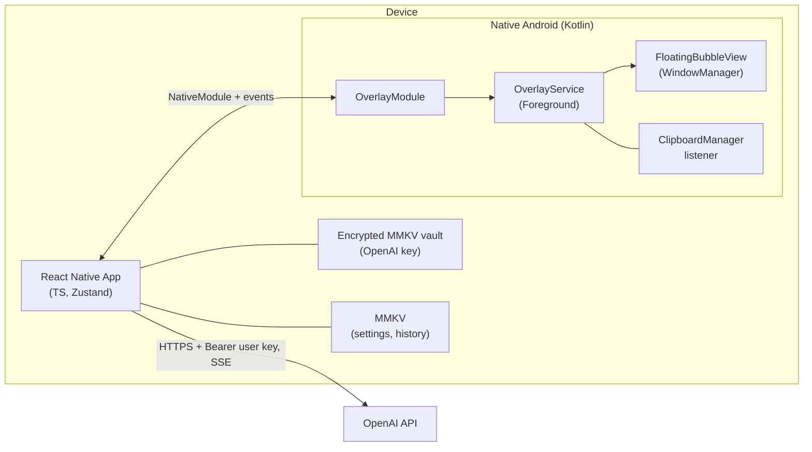
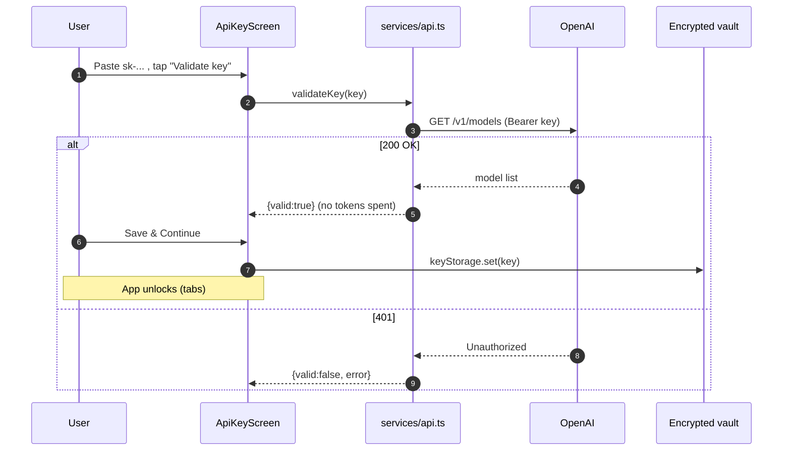
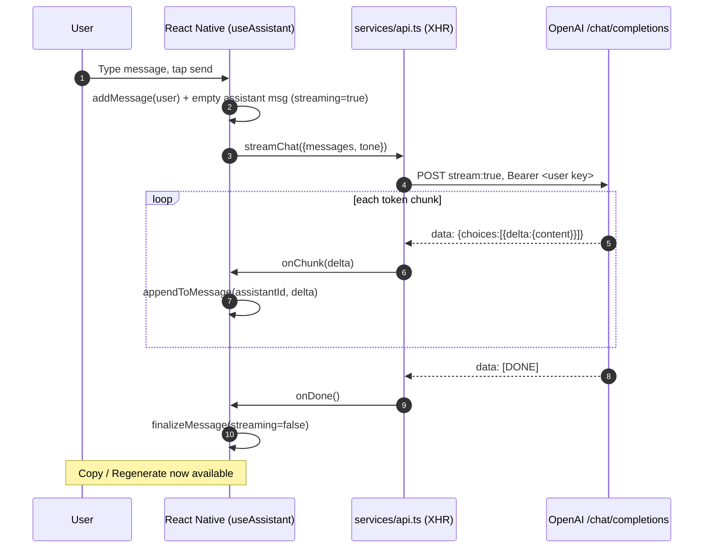
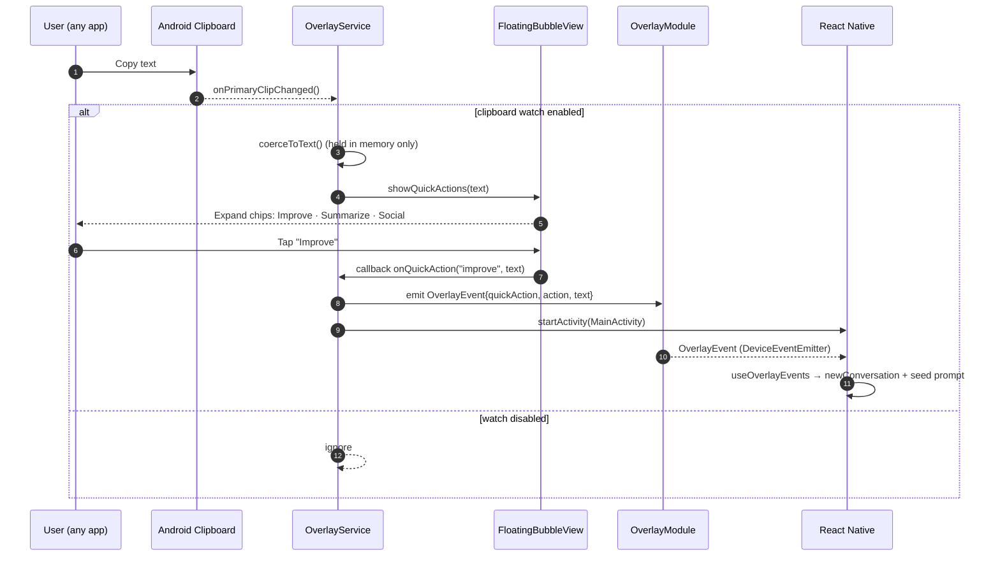
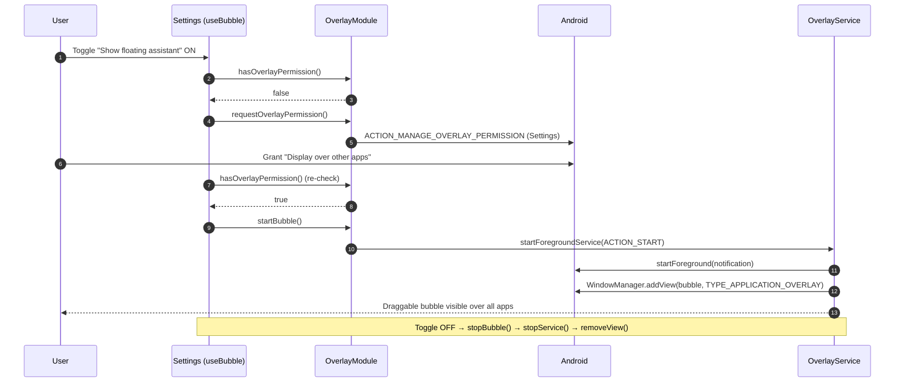

# Architecture & Sequence Diagrams

Diagrams use [Mermaid](https://mermaid.js.org) and render on GitHub. They cover
the flows that cross the app ↔ native ↔ OpenAI boundaries. The app uses **BYOK**:
it calls OpenAI directly with the user's own key — there is no backend.

## Components

The key is read from the encrypted vault and attached as a Bearer token. It
never leaves the device except in the request to `api.openai.com`.

---

## 0. First-launch key gate

---

## 1. Streaming AI response (chat / improve)

Token-by-token streaming over Server-Sent Events, straight from OpenAI.

**Regenerate** clears the assistant message content and replays the same
history (`useAssistant.regenerate` → another `streamChat` call).

---

## 2. Clipboard quick-action

Event-driven (no polling). Copied text is used transiently and never persisted
by the native layer.

---

## 3. Floating bubble lifecycle & overlay permission

---

## Data & secret boundaries

| Data | Where it lives | Notes |
| --- | --- | --- |
| OpenAI API key (user's own) | Encrypted MMKV vault on-device | `keyStorage.ts`; sent only to `api.openai.com` |
| Settings & chat history | Encrypted MMKV | `storage.ts` |
| Clipboard text | RAM only (native) | Never written to disk |
